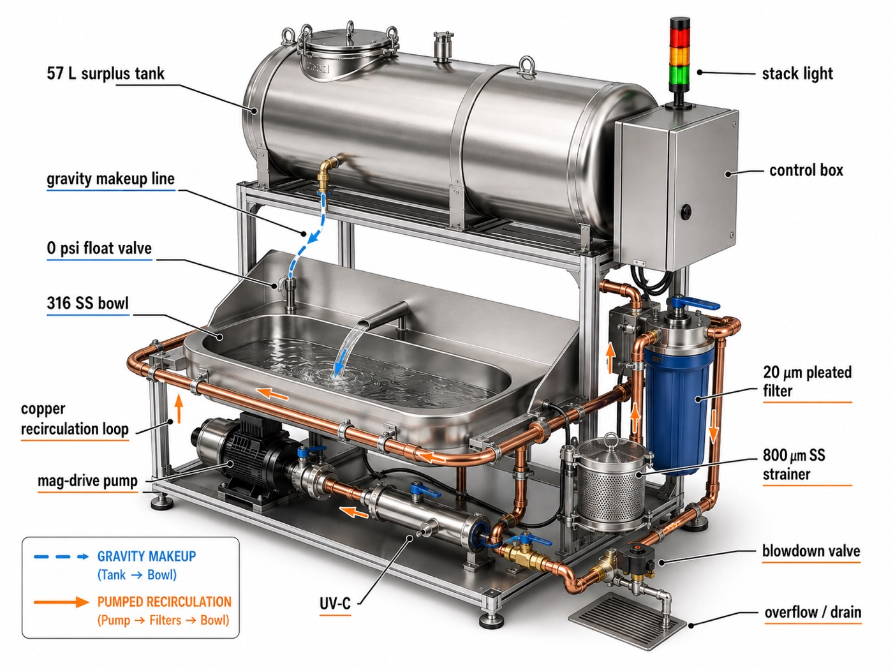
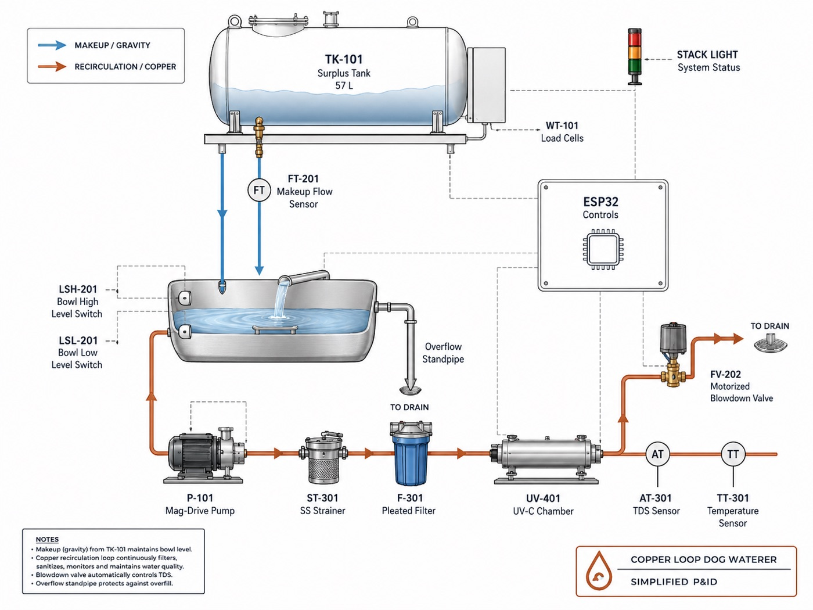
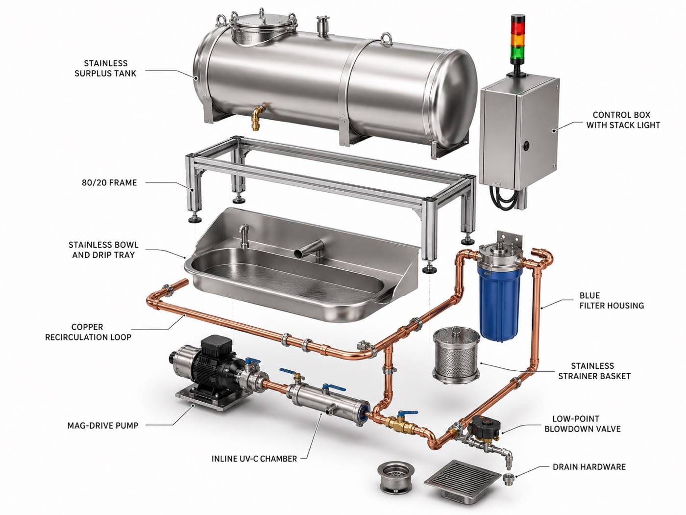

# Dog waterer, industrialised

> Take a $40 plastic dog fountain and build the version an engineer would build:
> copper pipe, real cleaning, a bigger tank, filters you don't change monthly, a surplus
> reservoir you refill occasionally, and something that tells you before it runs dry.

That was the brief. This repo is the answer, and the most useful thing in it is the finding
that **you probably shouldn't build the expensive one.**

**Concept render, not a built machine** — nothing here has been fabricated. Faithful to the spec where it counts: gravity makeup through a 0 psi float valve, hard-piped copper recirculation, strainer ahead of the pump, blowdown at the low point, all on a drip tray over a drain. Three things to correct if you build from it: the cartridge filter is on the *suction* side (put it on the discharge — suction-side ΔP rises as the element loads, and that's how you cavitate a pump), the makeup fitting is yellow brass where the spec calls for lead-free NSF-61 or stainless, and an AC mag-drive pump can't be PWM-throttled — you need variable speed to get both a quiet 2 L/min serve and a 10 L/min scouring CIP.

| | |
|---|---|
|  |  |
| Pictorial P&ID. Note two draughting errors: ST-301 is drawn downstream of P-101 (the strainer belongs upstream, protecting the impeller), and the return leg never closes back to the spout. Order of record: **bowl → ST-301 → P-101 → F-301 → UV-401 → riser → spout → bowl.** | Exploded assembly. Rough build order is bottom-up: frame, drip tray and bowl, then hang the loop — solder every copper joint on the bench before anything is mounted. |

📄 **[Read the full illustrated spec →](docs/spec.html)** — P&ID, sizing tables, the numbers.
Open it in a browser; it's a single self-contained file.

---

## Pick a tier and stop there

Each row is a complete, buildable system. Value does not increase linearly — tier 2 is where
the curve bends.

| Tier | System | Cost | Consumables | Refill | Tells you how |
|---|---|---|---|---|---|
| 0 | Typical consumer fountain (~2 gal, ABS) | $40 | carbon pads, monthly | ~2 d | an LED |
| 1 | Livestock gravity waterer + a drain | $70 | **none** | ~4 d | you look at it |
| 2 | **Tier 1 + load cells + stack light** ← build this | $130 | **none** | ~4 d | blinking light, no cloud |
| 3 | Copper recirc loop, UV, auto-blowdown, 57 L reservoir | $1,060 | UV lamp + gaskets, yearly | ~12 d | Prometheus → email |

A 5 gal livestock waterer plumbed to a drain wins on tank size, refillability, and filter
changes by *deleting components* — there is no pump to disassemble and no filter to replace,
ever. What it can't do is move the water or disinfect it, and that is the entire case for
tier 3. Build tier 2 first, live with it a month, and let the data tell you whether you want
the copper.

## Contents

| Path | What |
|---|---|
| [`docs/spec.html`](docs/spec.html) | **The illustrated spec.** P&ID, sizing, materials, cost. Start here. |
| [`DESIGN.md`](DESIGN.md) | Full tier-3 engineering spec, rationale, BOM |
| [`docs/TIER2.md`](docs/TIER2.md) | The cheap build, in detail |
| [`docs/HOSE-TIMER.md`](docs/HOSE-TIMER.md) | Automating a flush-on-fill livestock waterer: which timer, and the freeze/backflow/water-bill gotchas |
| [`docs/CIP.md`](docs/CIP.md) | Clean-in-place procedure and maintenance schedule |
| [`esphome/dogfountain.yaml`](esphome/dogfountain.yaml) | Firmware — sensors, interlocks, blowdown, stack light |
| [`prometheus/`](prometheus/) | Scrape config, alert rules, Alertmanager email, compose stack |

## The findings worth stealing even if you build none of this

**Delete the carbon.** In a closed recirculating loop, activated carbon is exhausted within days
for anything it actually adsorbs, it strips the chlorine that was keeping the water stable, and
it then becomes a warm dark high-surface-area bacterial substrate. That is why those pads "need"
replacing monthly — colonisation, not exhaustion. Mechanical strainer + washable pleated
cartridge + UV-C gets you to **one $25 consumable per year.**

**Blowdown, not filtration.** The real problem is recirculating the same 2 L of saliva-water for
a week, and no filter fixes it. Use the cooling-tower answer: with evaporation `E = 0.5 L/day`
and a target of `C = 1.5` cycles of concentration, a bleed of `B = E/(C−1) = 1.0 L/day` holds
bowl TDS at ≤1.5× tap forever. Trigger it on conductivity, but keep a **hard 24 h forced dump**
underneath — TDS is a weak proxy for saliva, and the control law should admit that.

**Oversize the pump for cleaning, not for serving.** 2 L/min through ½" line is 0.22 m/s —
quiet, pleasant, and useless for cleaning. PWM to 10 L/min for CIP: 1.1 m/s, Re ≈ 15,000, fully
turbulent. Turbulent shear is what removes biofilm; a slow rinse does not.

**Quantify the copper before you commit to it.** Water at the EPA action level of 1.3 mg/L adds
~1.5 mg/day against a ~2.6 mg/day NRC allowance for a 30 kg dog — not toxic, but ~60% on top of
diet. Continuous recirculation kills the contact time that drives leaching. Check your utility's
pH and alkalinity, use lead-free solder and NSF-61 brass, and actually test the water (target
< 0.3 mg/L). Copper-associated hepatopathy is breed-linked; with a Bedlington, Labrador, or
Doberman, go 316L wetted and use copper as cladding.

**Verify actuators, not commands.** "Relay closed" is not "lamp emitting." Current monitoring on
the UV ballast and the pump turns a silent failure into an alert. Same logic makes the DIY hose
timer worth building: a flow sensor proves the valve actually opened.

**Don't let the alert path share fate with what it watches.** If the server is down, the server
cannot tell you the dogs have no water. Bowl-dry and leak fire from the device itself, and the
red stack light needs no network at all.

**`predict_linear` beats a fixed threshold.** `predict_linear(reservoir_liters[12h], 48*3600) < 0`
gives constant lead time regardless of how fast they're drinking.

**The reason to instrument rather than just enlarge.** Reservoir mass on load cells, minus
blowdown and modelled evaporation, is daily household water intake. Sustained polydipsia leads
chronic kidney disease, diabetes mellitus, and hyperadrenocorticism by months. Route it at
`severity: info`, never to anything that pages — it's a household aggregate, so it says *someone*
changed, not who, and it's a prompt to book a vet visit, not a diagnosis.

## Status

Prometheus rules validated with `promtool` (15 rules), Alertmanager config with `amtool`. The
ESPHome config is YAML-valid but **has not been compiled or run against hardware** — component
syntax drifts between releases, so run `esphome config` before flashing. Load-cell scale/tare,
flow k-factor, and the TDS polynomial are placeholders that need calibrating against your build.

Nothing here has been through a plumbing inspection. Backflow prevention on any potable
connection is not optional, and is the one part of this you should not improvise.

## License

MIT. See [LICENSE](LICENSE).
